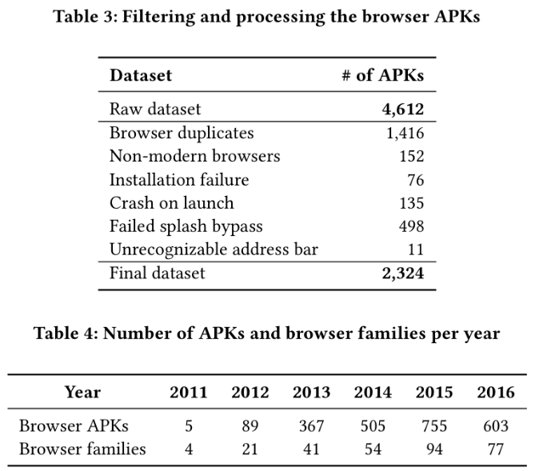
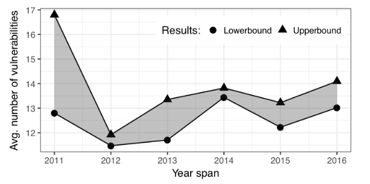
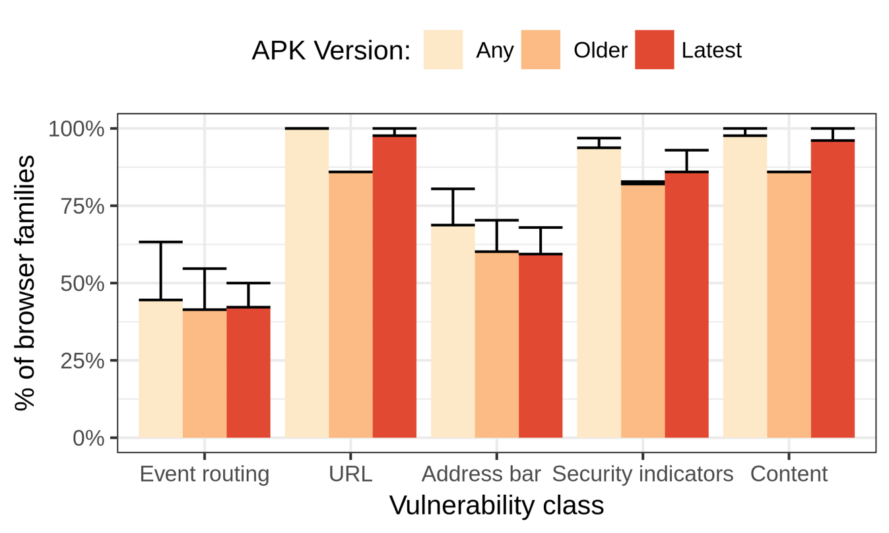
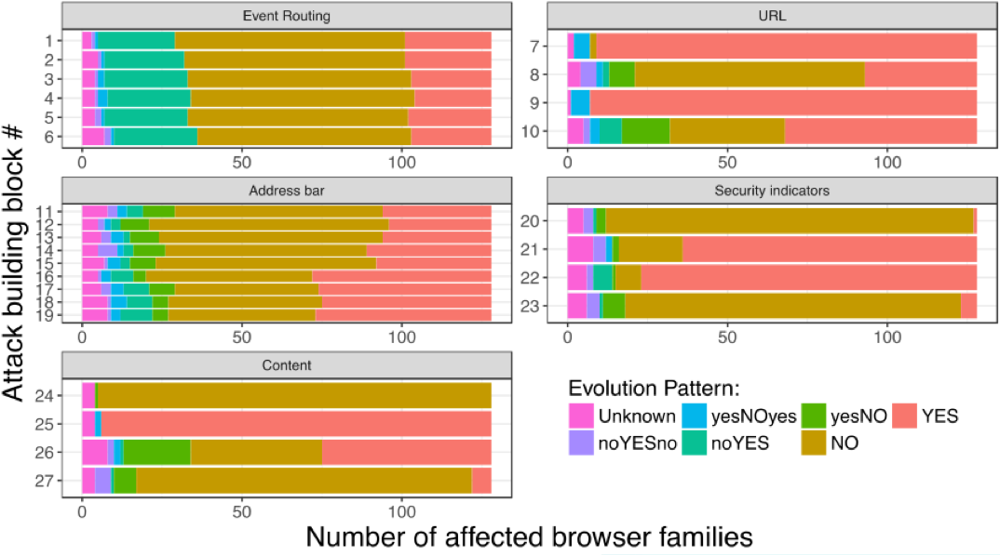

# Note of Understanding the Evolution of UI Vulnerabilities in Mobile Browsers

[TOC]

## 概述

大部分移动安全研究都专注于恶意应用，然而广泛使用的浏览器的安全却很少被提及，而移动端的浏览器至少和桌面端的浏览器一样容易受到攻击。这篇文章则是首次从事这样的研究，专注于手机浏览器的 UI 漏洞。作者根据前人的工作以及自己的调查，量化了 27 个 UI 相关的攻击，针对于超过 128 个浏览器家族以及 2324 个独立的浏览器版本（跨度超过 5 年）进行了浏览器 UI 的安全性研究，基本的步骤如下

- 作者从不同的源中收集了不同时期的浏览器样本。
- 作者设计并实现了与浏览器无关的测试框架， Hindsight，自动化地测试浏览器 UI 的漏洞。

最后，作者发现，98.6% 的浏览器至少受到一种攻击的影响，而且随着时间的变化，移动端浏览器的平均安全性变得越来越差。

因此，作者认为目前手机浏览器的安全性被忽视了，应该受到重视。

我主要关注于文中的如下内容

- 移动端浏览器 UI 漏洞的基本攻击块。
- 移动端浏览器的数据收集方法与相应数据集。
- Hindsight 的基本执行流程以及作者解决相关问题的方法。
- 测量的结果与结果所反应的现实情况。

## 基本攻击块

为了评估移动端手机浏览器的 UI 安全性，作者首先调研了之前相关的研究，以便于找到一些已有的攻击方法。基于这样的发现，作者猜测了浏览器和网站交互的方式，并指出浏览器尝试为要渲染的网站提供最大化的空间。通过不断地尝试，作者发现了已有攻击的一些变种。此外，为了说明这些漏洞既可以被单独使用也可以被联合使用，作者将每一种攻击都命名为 ABB（Attack Building Block）。更加具体的，如下表所示，作者将收集到攻击方法分为以下类。

可以发现，这里很多的攻击都是钓鱼攻击。

## 数据收集

由于作者希望测量近些年来手机浏览器 UI 漏洞的演进过程，所以作者收集了来自于不同时期的不同家族的浏览器，具体步骤如下

1. 使用 Selenium 来自动化地收集 Google Play 中包含 browser 关键字的apk，并过滤一些不是 web 的浏览器，比如文件浏览器。
2. 收集不同版本的浏览器。为了获取旧版本的浏览器，作者从不同的网站（An- droidapps, Apkhere, Apkmirror, Apkpure, Uptodown, 以及 Aptoide）中，爬取了尽可能多的 APKs。
3. 过滤一些 APKs，比如过滤相同的浏览器。

最后，作者获取的 APK 的统计结果如下

可以发现，作者在进行了过滤之后，最后一共有 2324 个 APK，而且，显然，随着时间的增加，每一年的浏览器的 APK 数量不断增加。

## 基本测试框架

### 概览

作者设计并实现了一个自动化的漏洞测试框架，Hindsight，基本步骤如下

1. SDK 分配。由于每个 APK 都会有 targetSdkVersion 以及 min sdkVersion，所以该框架需要为对应的 APK 分配一个合适的手机，使得其可以正常运行。
2. 安装以及启动屏幕绕过。使用 ADB 安装对应 APK，并绕过 APK 启动时的一些欢迎界面，以及一些提示信息。
3. ABB 测试。使用预先编写好的 ABB 的测试逻辑对安装好的 APK 进行测试，并输出相关的信息。
4. 结果评估。对输出的信息进行分析，说明这个浏览器是否会受到相应的 ABB 的攻击。

框图如下。

这里我主要关注于框架中的以下两部分。

### 浏览器无关的 UI 分析的实现

由于作者想要自动化地对这个程序进行分析，所以作者自然需要自动化地识别如地址栏一些的信息，自然作者也就需要打造一个 浏览器无关的 UI 测试框架。作者认为，在 2~4 步中主要需要解决的问题是：如何分析给定的应用的 UI 来决定某些元素是否存在以及如果存在的话，具体在屏幕的哪个位置。更加具体的，这些 UI 元素主要包括应用级别的 UI 元素，比如地址栏，挂锁，图标，以及标签页；webpage 的内容。作者针对于这两种元素，分别提出了相应的解决办法

- 应用级别的 UI 元素。大部分浏览器都会使用标准的 Android UI 库。这就使得 Hindsight 可以使用 UI Automator 来获取应用 UI 的 DOM 的 XML dump，包括网站中的文字，图片，甚至坐标。
- Webpage 的元素。不能够依赖于上述的 dump方法，因为很多浏览器渲染的网站内容并不是 DOM 中的一部分，因为测试者需要定位屏幕上某个按钮的位置。因此作者就采用了 OCR 识别来解决这个问题。

作者在使用 OCR 时，也指出OCR 方法局限性以及相应解决办法

- 不同浏览器渲染同一个网页的方法可能是不一样的。比如对于同样一个网页，不同的浏览器可能会使用不同的字体来进行渲染。通过不断尝试多次，作者认为，对于 ABB 中重要的文本元素，需要使用不同的字体大小以及家族重复多次，以便于提高被 OCR 识别的效率。
- 渲染的网页可能并不是网页中唯一出现的内容，比如一些其他的信息，如提示信息，更新信息。作者通过两种方法来解决了这种问题
  1. 作者通过自动化识别的方法来点击这些提示信息，消除这些提示信息。
  2. 作者在设计 ABB 测试网页的时候尽可能地使得网页的内容靠近屏幕中间。

通过这样的 UI 分析，作者为自动点击相关按钮，填写文字内容等需要在 2-4 步骤中需要的事情提供了一种解决办法。

### 结果验证

作者指出，由于这样的框架是被首个提出来的，所以目前没有可以验证他们的方法，所以只能使用手工验证。因此，作者在使用上述方法的时候，确保

- 测试结果尽可能是用户友好的，即尽可能可读。
- 所有设备相关的截图都会被保存

对于目前的数据集，作者指出这大概会花费一个人 60 个小时的时间来完成，而且，自动化测试逻辑的错误概率是 1.5%，其实还是很低的。

## 评估

在收集到的 2324 个 APK 中，作者分别都进行了 27 种 ABB 的测试，结果发现错误的概率大约有 3.6%，其中1.5 由检查的人发现，2.1% 由 Hindsight 框架发现。作者进一步分别将所有的错误分别分为有漏洞和安全，考虑了有漏洞的 APK 的上界和下界。

近几年手机端浏览器的 UI 漏洞的总体发展趋势如下

更具体的，作者考虑浏览器容易受到多少个相关漏洞的影响呢？

作者发现，98% 的浏览器至少受到 1 种 ABB 的影响，50% 的浏览器至少受到 12 种 ABB 的影响。

针对于不同种类的漏洞，作者发现浏览器更容易受到 URL 方面的漏洞影响。

而且，新版本的浏览器不见得比旧版本的浏览器的漏洞更少，比如 Chrome 浏览器。

此外，浏览器的安装程度与其受欢迎的程度有时候并没有什么必然的联系，比如作者发现排名第 13 的 Shark 浏览器受到的 Event Routing 和 Address bar 相关种类的漏洞影响的个数就比排名的 1 的 Chrome 浏览器少很多。

更进一步，作者分析了随着时间的推进，每种浏览器针对于某种漏洞的变化确实，作者首先给出了如下的定义

- 总是有漏洞的标记为 YES
- 从安全的变为不安全的标记为 noYES
- 临时有漏洞即为 noYESno
- 在有漏洞和没有漏洞之间回归记为 yesNOyes

作者给出了一个 yesNOyes 的例子，如 Dolphin browser 的如下版本，在面对长 URL 的时候可能会表现出不同的现象。

并且，作者给出了整体的效果，如下

可以发现整体来说

- 有漏洞的几乎总是漏洞。
- 没有漏洞的在新版本中会有一定概率出现漏洞。
- 对于 noYESno 以及 YESnoYES 则出现的情况较少。

## 相关工作

太多了，参考基本攻击块的表格。

## 个人思考

### 优点

- 作者收集了足够多的手机端的浏览器。
- 作者的测试方法是自动化的，而且还可以不断集成新的漏洞种类。
- 作者从不同角度分析了近些年来浏览器 UI 漏洞发展的历史。

### 缺点

- 作者虽然分析了这么多浏览器，但是其实很多用户都不使用，并没有反映到这些漏洞对于现实用户的影响。
- hindsight 在绕过一些开始安装 APK 时，仍然存在一些不足。
- 由于物理资源的限制，作者只是用了 4 个SDK 版本的手机。如果使用更多版本的话，获取曾经安装失败的浏览器可能就可以安装成功了。
- 作者在最后仍然对结果进行了手工分析，难以做到全自动化。

